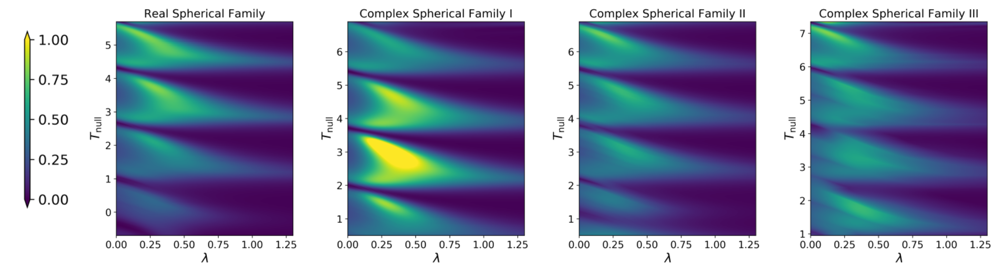
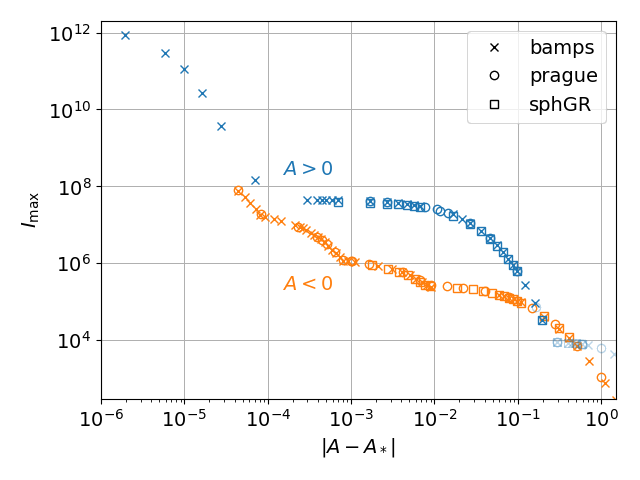
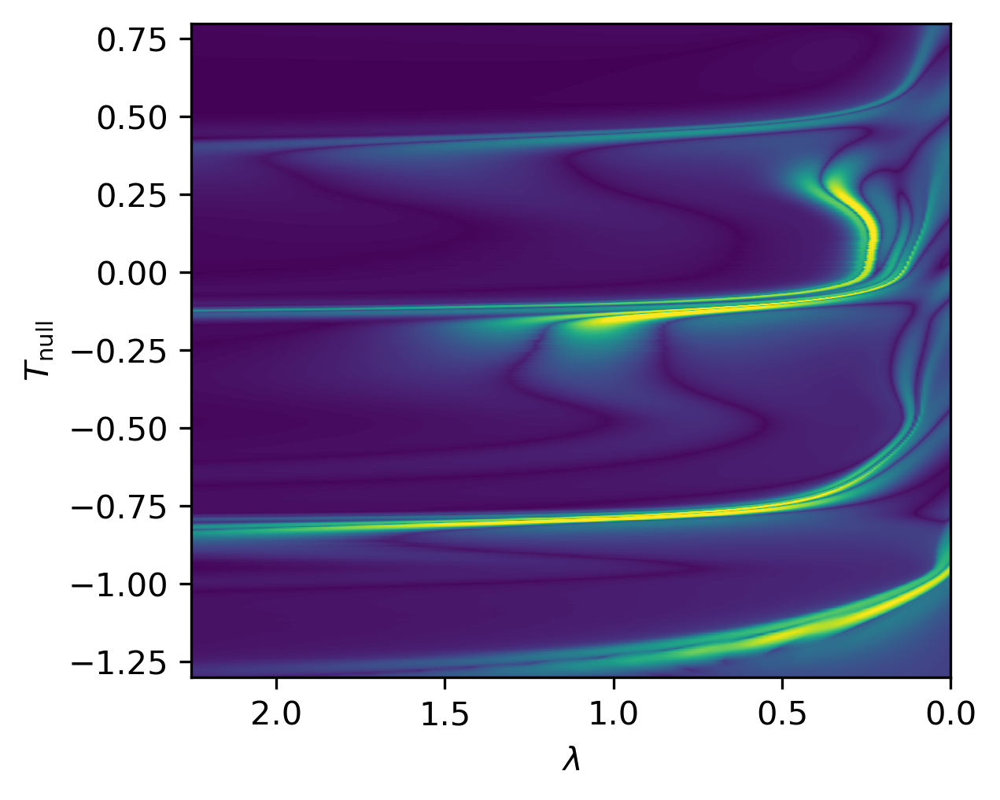
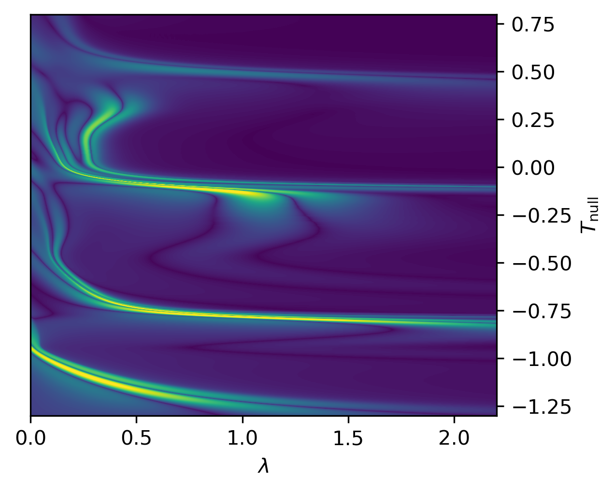
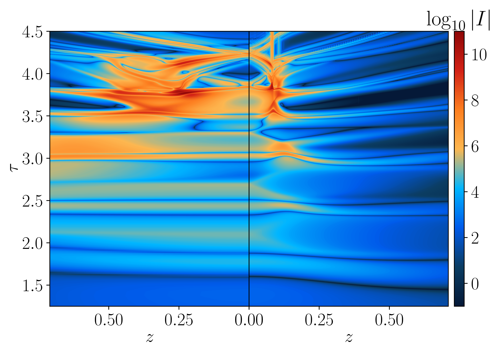
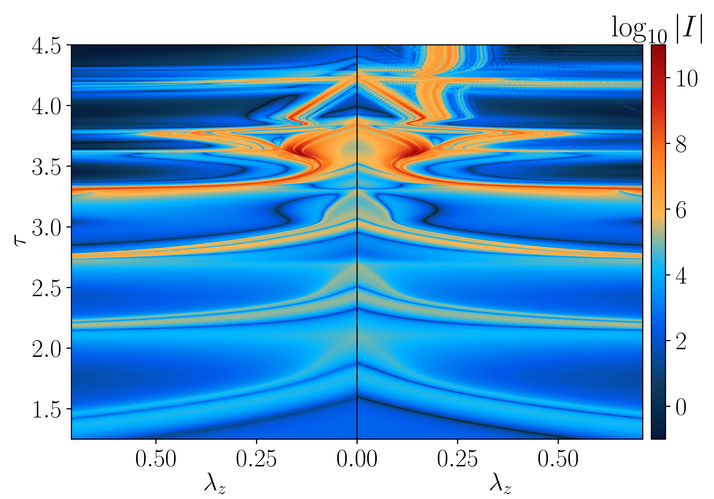
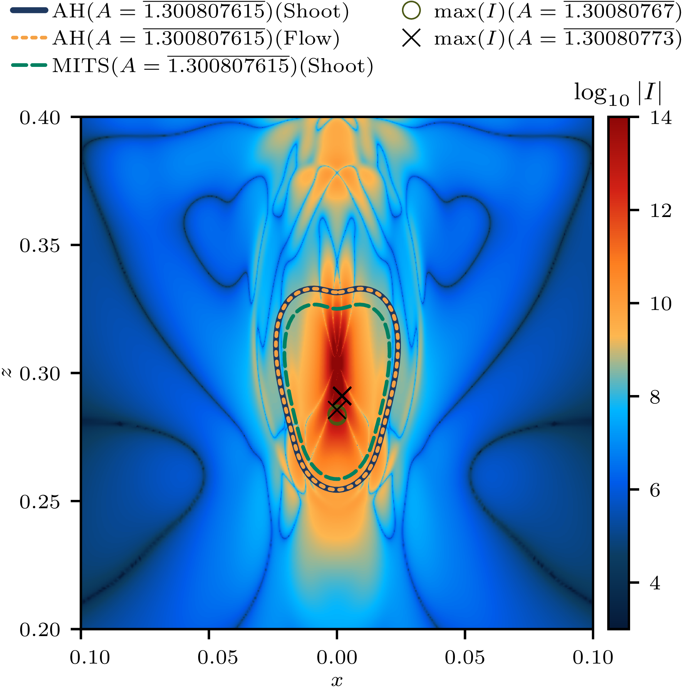
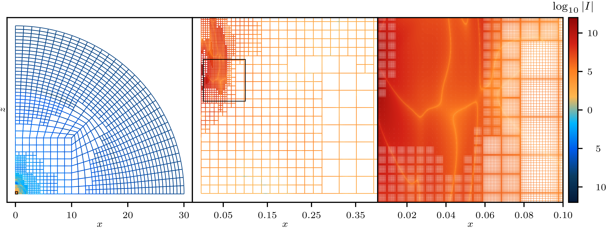
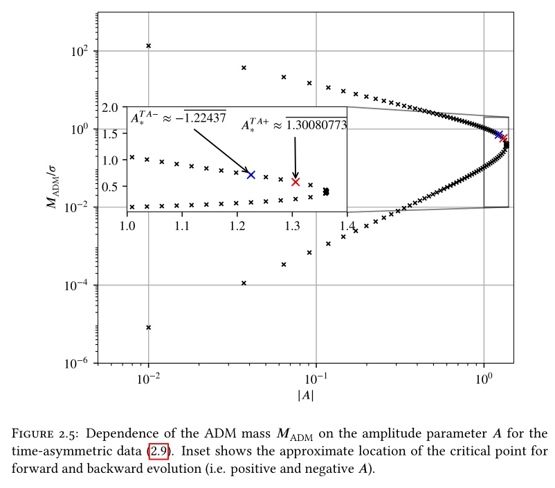

##  {.section-title-slide background-image="viz/sec_t17.78_alt.png" background-size="contain" background-position="left"}

:::::: columns
::: {.column width="50%"}
:::

:::: {.column width="50%"}
::: section-title-text
General Picture
:::
::::
::::::

<!-- ================================================================ -->

## The "golden ball": Stories in spherical symmetry

Tuning one-parameter $(p)$ families to the collapse threshold $p_\star$:

- Arbitrarily small black holes: $M_{\mathrm{BH}} \propto (p-p_\star)^\gamma$

- Universal power law scaling



- Universal self similar solution

{.single-sph-img}

::: {.single-sph-title}
Marouda <em>et al</em>. 2024
:::


<!-- ================================================================ -->

## The not-so-golden (?) egg: away from spherical sym.

- Spherically symmetric scalar field




- Axisymmetric vacuum



<!-- ================================================================ -->

## ?

:::::: columns
::: {.column width="50%"}

- Are the different exponents numerical artefacts?
- Are they physical?
- How do we verify?

<span style="font-size: 1.35em; font-weight: bold;">Ultimately:

What is the nature of spacetimes at the threshold of axisymmetric vacuum collapse?</span>

:::

::: {.column width="50%"}

<div style="padding-top: 200px; text-align: center;">
  
</div>

:::
::::::

<!-- ================================================================ -->

##  {.section-title-slide background-image="viz/sec_t17.14.png" background-size="contain" background-position="right"}

:::::: columns
::: {.column width="50%"}
::: section-title-text
Comparisons: Initial Steps
:::
Baumgarte <em>et al</em>. Phys. Rev. Lett. 131, 181401 (2023) [[arxiv:2305.17171](https://arxiv.org/abs/2305.17171)]
:::

:::: {.column width="50%"}
::::
::::::

<!-- ================================================================ -->

## Tools in our box
::::::::: columns
:::::::{.column width="33.33333333%"}
<div style="text-align: center;">`bamps`</div>


- Spectral methods
- Generalized Harmonic system
- Cartoon reduction of 3+1
- Domain split into subgrids
- Dynamic adaptive mesh refinement (AMR)
- MPI paralellized
:::::::

:::::{.column width="33.33333333%"}
<div style="text-align: center;">`prague`</div>

- Finite difference
- BSSN
- Cartoon reduction of 3+1
- Box-in-box mesh
- Fixed refinement levels (FMR)
- Hybird parallelized

:::::
:::{.column width="33.33333333%"}
<div style="text-align: center;">`sphGR`</div>
- Finite difference on spherical polar coordinates
- BSSN
- Cartoon reduction of 3+1
- Cell-cenetred grid with unit vector field decomposition

:::
:::::::::

<!-- ================================================================ -->

## Centered Brill scaling: `bamps`, `prague`, and `sphGR` {#centered-brill-scaling}

Kretschmann scalar $I = R_{abcd} R^{abcd}$ scaling for centered [twist-free Brill initial data](#brill-ansatz) with $A > 0$ and $A < 0$:

<div style="padding-top: 10px; text-align: center;">
  
</div>

<!-- ================================================================ -->

##  Centered Brill spacetimes: `bamps` and `prague` {#centered-brill-spacetime}

Centered [twist-free Brill initial data](#brill-ansatz) with $A > 0$ and $A < 0$:

:::::: columns
:::{.column width="50%"}


<div style="padding-top: 10px; text-align: center;">
  `bamps`
  
</div>
:::

:::: {.column width="50%"}


<div style="padding-top: 10px; text-align: center;">
  `prague`
  
</div>
::::
::::::

<!-- ================================================================ -->

## Initial conclusions

For the chosen two families of data:

- excellent agreement in scaling
- excellent agreement in the spacetime computed

<span style="font-size: 1.35em; font-weight: bold;">Need further investigation for more families!</span>

<!-- ================================================================ -->

##  {.section-title-slide background-image="viz/sec_t16.8.png" background-size="contain" background-position="left"}

:::::: columns
::: {.column width="50%"}
:::

:::: {.column width="50%"}
::: section-title-text
Comparisons: Beyond
:::
Adhikari <em>et al</em>. 2026 [arxiv:2607.TOMORROW (submit/7817008 )]
::::
::::::

<!-- ================================================================ -->

##  Scaling, again! (Last, I promise!!!) {#new-scaling}

Off-centered [twist-free Brill initial data](#brill-ansatz) with $A < 0$ and
[time-asymmetric waves](#ta-waves) with $A$ in the
[upper branch](#ta-waves-branch):


<div style="height: 10px;"></div>

```{python}
#| echo: false
#| warning: false
#| message: false
#| fig-width: 13
#| fig-height: 5
#| out-width: "100%"
#| fig-align: center

import numpy as np
import matplotlib.pyplot as plt
from pathlib import Path
from matplotlib.lines import Line2D

# Matplotlib style settings, but NOT backend or figure.figsize.
params = {
  "axes.labelsize": 18,
  "font.size": 18,
  "legend.fontsize": 18,
  "xtick.labelsize": 18,
  "ytick.labelsize": 18,
  "text.usetex": True,
  "font.family": "DejaVu Sans",
  "axes.labelpad": 10,
  "axes.formatter.use_mathtext": True,
  "axes.formatter.limits": (-3, 3),
  "axes.formatter.useoffset": False,
  "legend.borderaxespad": 0.3,
  "legend.borderpad": 0.3,
  "legend.columnspacing": 1,
  "legend.handletextpad": 0.0,
  "legend.labelspacing": 0.3,
  "legend.framealpha": 0,
  "lines.dash_capstyle": "round",
  "lines.dash_joinstyle": "round",
  "lines.linewidth": 1.25,
  "lines.linestyle": "",
  "lines.markeredgewidth": 1.25,
  "lines.markersize": 12,
  "lines.solid_capstyle": "round",
  "lines.solid_joinstyle": "round",
  "markers.fillstyle": "none",
  "grid.linestyle": "",
  "grid.alpha": 0.4,
  "savefig.transparent": True,
}

with plt.rc_context(params):
  # Best tuned sub and sup amps for bamps non-time-symmetric data
  sub_best, sup_best = 1.3008077675, 1.300807615
  a_star = 0.5 * (sup_best + sub_best)

  # A star for Brill data
  a_star_B_b, a_star_B_p, a_star_B_s = -3.509063, -3.509113, -3.5088

  # Bamps non-time-symmetric data
  data_bamps_p1 = np.loadtxt("/home/ananya/research/papers/crit_collapse_2023_long/figure_gen/amps_CSImaxs_bamps_p1.txt")
  data_bamps_p2 = np.loadtxt("/home/ananya/research/papers/crit_collapse_2023_long/figure_gen/amps_CSImaxs_bamps_p0.5.txt")

  # Prague non-time-symmetric data
  data_prague = np.loadtxt("/home/ananya/research/papers/crit_collapse_2023_long/figure_gen/amps_CSImaxs_prague.txt")

  a_bamps_p1, CSI_max_bamps_p1 = data_bamps_p1[:, 0], data_bamps_p1[:, 1]
  a_bamps_p2, CSI_max_bamps_p2 = data_bamps_p2[:, 0], data_bamps_p2[:, 1]
  a_prague, CSI_max_prague = data_prague[:, 0], data_prague[:, 1]

  # Brill data
  top = Path("/home/ananya/research/papers/crit_collapse_2023_long/figure_gen/data/brill/BrillScalingData")

  data_bamps_bAm = np.loadtxt(top / "Bamps_Centered_Brill_Aneg.txt")
  data_prague_bAm = np.loadtxt(top / "Prague_Centered_Brill_Aneg.txt")
  data_sphgr_bAm = np.loadtxt(top / "SphGR_Centered_Brill_Aneg.txt")

  a_bamps_bAm, CSI_max_bamps_bAm = data_bamps_bAm.T
  a_prague_bAm, CSI_max_prague_bAm = data_prague_bAm.T
  a_sphgr_bAm, CSI_max_sphgr_bAm = data_sphgr_bAm.T

  # Brill masks
  log_amas_B_s = -np.log10(np.abs(a_sphgr_bAm - a_star_B_s))
  log_amas_B_p = -np.log10(np.abs(a_prague_bAm - a_star_B_p))
  log_amas_B_b = -np.log10(np.abs(a_bamps_bAm - a_star_B_b))

  log_amas_B_b_mask = log_amas_B_b > -0.2
  log_amas_B_s_mask = log_amas_B_s < 2.65

  # Figure
  fig, axs = plt.subplots(1, 2)
  fig.subplots_adjust(left=-0.5, bottom=-0.1, right=0.99, top=0.99, hspace=0.25, wspace=0.2)

  ax1, ax2 = axs.flatten()

  # Transparent patches for slide background
  fig.patch.set_alpha(0)
  ax1.patch.set_alpha(0)
  ax2.patch.set_alpha(0)

  # Brill plot
  ax1.plot(
    log_amas_B_b[log_amas_B_b_mask],
    np.log10(CSI_max_bamps_bAm)[log_amas_B_b_mask],
    label=r"$\mathrm{\tt bamps}~\mathrm{B}$",
    marker="x",
    color="#333D6D",
  )

  ax1.plot(
    log_amas_B_p,
    np.log10(CSI_max_prague_bAm),
    label=r"$\mathrm{\tt prague}~\mathrm{B}$",
    marker="o",
    color="#c8620f",
  )

  ax1.plot(
    log_amas_B_s[log_amas_B_s_mask],
    np.log10(CSI_max_sphgr_bAm)[log_amas_B_s_mask],
    label=r"$\mathrm{\tt sphGR}~\mathrm{B}$",
    marker="s",
    color="#139acf",
  )

  # Non-time-symmetric plot
  ax2.plot(
    -np.log10(a_bamps_p1 - a_star),
    np.log10(CSI_max_bamps_p1),
    label=r"$\mathrm{\tt bamps}~\mathrm{TA}~(\mathcal{G}_1)$",
    marker="x",
    color="#333D6D",
  )

  ax2.plot(
    -np.log10(a_bamps_p2 - a_star),
    np.log10(CSI_max_bamps_p2),
    label=r"$\mathrm{\tt bamps}~\mathrm{TA}~(\mathcal{G}_2)$",
    marker="+",
    color="#00a878",
  )

  ax2.plot(
    -np.log10(a_prague - a_star),
    np.log10(CSI_max_prague),
    label=r"$\mathrm{\tt prague}~\mathrm{TA}$",
    marker="o",
    color="#c8620f",
  )

  ax1.legend(loc="lower right")
  ax2.legend(loc="best")

  ax1.set_ylabel(r"$\log_{10}|I_\mathrm{max}|$")
  ax1.set_xlabel(r"$-\log_{10}(A_\star - A)$")

  ax2.set_ylabel(r"$\log_{10}|I_\mathrm{max}|$")
  ax2.set_xlabel(r"$-\log_{10}(A_\star - A)$")

  plt.show()
```

<!-- ================================================================ -->

##  Scaling, again! (Last, I promise!!!) {#scaling-fits}

[Fits](#fit-results):


<div style="height: 10px;"></div>

```{python}
#| echo: false
#| warning: false
#| message: false
#| fig-width: 13
#| fig-height: 5
#| out-width: "100%"
#| fig-align: center

import numpy as np
import matplotlib.pyplot as plt
from pathlib import Path


## for DSS fits
from scipy.signal import find_peaks
from scipy.optimize import curve_fit

# Matplotlib style settings, but NOT backend or figure.figsize.
params = {
  "axes.labelsize": 18,
  "font.size": 18,
  "legend.fontsize": 18,
  "xtick.labelsize": 18,
  "ytick.labelsize": 18,
  "text.usetex": True,
  "font.family": "DejaVu Sans",
  "axes.labelpad": 10,
  "axes.formatter.use_mathtext": True,
  "axes.formatter.limits": (-3, 3),
  "axes.formatter.useoffset": False,
  "legend.borderaxespad": 0.3,
  "legend.borderpad": 0.3,
  "legend.columnspacing": 1,
  "legend.handletextpad": 1,
  "legend.labelspacing": 0.3,
  "legend.framealpha": 0,
  "lines.dash_capstyle": "round",
  "lines.dash_joinstyle": "round",
  "lines.linewidth": 2.75,
  "lines.linestyle": "",
  "lines.markeredgewidth": 1.25,
  "lines.markersize": 12,
  "lines.solid_capstyle": "round",
  "lines.solid_joinstyle": "round",
  "markers.fillstyle": "none",
  "grid.linestyle": "",
  "grid.alpha": 0.4,
  "savefig.transparent": True,
}

############################################################################
# functions for fitting

def linear_fit(X, Y):
    linfit, linerr = np.polyfit(X, Y, 1, cov=True)
    slope, intercept = linfit
    slope_err, intercept_err = np.sqrt(np.diag(linerr))
    coerr = linerr[0, 1]
    exponent = slope / 4
    exponent_err = slope_err / 4
    return dict(slope=slope, intercept=intercept, slope_err=slope_err,
                intercept_err=intercept_err, coerr=coerr,
                exponent=exponent, exponent_err=exponent_err)


def linear_residual(X, Y, fit):
    residual = Y - (fit['slope']*X + fit['intercept'])
    residual_err = np.sqrt(X**2 * fit['slope_err']**2 + fit['intercept_err']**2
                         + 2*X*fit['coerr'])
    return residual, residual_err

def period_from_peaks(X, Y, Y_err, prominence_frac, fallback_period=None,
                      label=""):
    idx, _ = find_peaks(Y, prominence=prominence_frac * np.ptp(Y))
    period = np.mean(np.diff(X[idx]))
    if not np.isfinite(period):
        warnings.warn(f"{label}: fewer than 2 peaks found.")
        period = fallback_period
    d2ydx2 = np.gradient(np.gradient(Y, X), X)
    peak_err = Y_err[idx] / np.abs(d2ydx2[idx])
    derr = np.sqrt(peak_err[1:]**2 + peak_err[:-1]**2)
    period_err = np.sqrt(np.sum(derr**2)) / len(derr) if len(derr) else np.nan
    if not np.isfinite(period_err):
        period_err = period * 0.5
    return period, period_err, idx

def sinusoidal(x, a, b, A, T, d):
    c = 2 * np.pi / T
    return a * x + b + A * np.sin(c * x + d)

def double_fit(X, Y, slope_lin, intercept_lin, period_guess):
    ini_A = np.ptp(Y - (slope_lin*X + intercept_lin)) / 2
    p0 = [slope_lin, intercept_lin, ini_A, period_guess, 0.0]
    bounds = ([-np.inf, -np.inf, 0, 0.5*period_guess, -np.pi],
              [ np.inf,  np.inf, np.inf, 2.0*period_guess,  np.pi])
    popt, pcov = curve_fit(sinusoidal, X, Y, p0=p0, bounds=bounds, maxfev=20000)
    perr = np.sqrt(np.diag(pcov))
    slope, intercept, A, period, d = popt
    slope_err, intercept_err, A_err, period_err, d_err = perr
    exponent, exponent_err = slope/4, slope_err/4
    residual = Y - (slope*X + intercept)
    return dict(slope=slope, intercept=intercept, A=A, period=period, d=d,
                exponent=exponent, exponent_err=exponent_err,
                period_err=period_err, residual=residual)

############################################################################

with plt.rc_context(params):
  # Best tuned sub and sup amps for bamps non-time-symmetric data
  sub_best, sup_best = 1.3008077675, 1.300807615
  a_star = 0.5 * (sup_best + sub_best)

  # A star for Brill data
  a_star_B_b, a_star_B_p, a_star_B_s = -3.509063, -3.509113, -3.5088

  # Bamps non-time-symmetric data
  data_bamps_p1 = np.loadtxt("/home/ananya/research/papers/crit_collapse_2023_long/figure_gen/amps_CSImaxs_bamps_p1.txt")
  data_bamps_p2 = np.loadtxt("/home/ananya/research/papers/crit_collapse_2023_long/figure_gen/amps_CSImaxs_bamps_p0.5.txt")

  # Prague non-time-symmetric data
  data_prague = np.loadtxt("/home/ananya/research/papers/crit_collapse_2023_long/figure_gen/amps_CSImaxs_prague.txt")

  a_bamps_p1, CSI_max_bamps_p1 = data_bamps_p1[:, 0], data_bamps_p1[:, 1]
  a_bamps_p2, CSI_max_bamps_p2 = data_bamps_p2[:, 0], data_bamps_p2[:, 1]
  a_prague, CSI_max_prague = data_prague[:, 0], data_prague[:, 1]

  # Brill data
  top = Path("/home/ananya/research/papers/crit_collapse_2023_long/figure_gen/data/brill/BrillScalingData")

  data_bamps_bAm = np.loadtxt(top / "Bamps_Centered_Brill_Aneg.txt")
  data_prague_bAm = np.loadtxt(top / "Prague_Centered_Brill_Aneg.txt")
  data_sphgr_bAm = np.loadtxt(top / "SphGR_Centered_Brill_Aneg.txt")

  a_bamps_bAm, CSI_max_bamps_bAm = data_bamps_bAm.T
  a_prague_bAm, CSI_max_prague_bAm = data_prague_bAm.T
  a_sphgr_bAm, CSI_max_sphgr_bAm = data_sphgr_bAm.T

  # Brill masks
  log_amas_B_s = -np.log10(np.abs(a_sphgr_bAm - a_star_B_s))
  log_amas_B_p = -np.log10(np.abs(a_prague_bAm - a_star_B_p))
  log_amas_B_b = -np.log10(np.abs(a_bamps_bAm - a_star_B_b))

  log_amas_B_b_mask = log_amas_B_b > -0.2
  log_amas_B_s_mask = log_amas_B_s < 2.65

  ###############################################
  # Brill

  bamps_X_B = log_amas_B_b[log_amas_B_b_mask]
  bamps_Y_B = np.log10(CSI_max_bamps_bAm)[log_amas_B_b_mask]

  # full linear fit for exponent
  fit_B = linear_fit(bamps_X_B, bamps_Y_B)
  slope_lin_B, intercept_lin_B = fit_B['slope'], fit_B['intercept']
  exponent_lin_B, exponent_lin_err_B = fit_B['exponent'], fit_B['exponent_err']

  # range for fitting in x-axis
  X_cut_B = 2.0 # brill
  clear_B = bamps_X_B > X_cut_B

  # linear fit for exponent in the clearer region towards the threshold
  X_clear_B, Y_clear_B = bamps_X_B[clear_B], bamps_Y_B[clear_B]
  fit_clear_B = linear_fit(X_clear_B, Y_clear_B)

  # subtract away linear fit to move towards DSS sinusoidal fit
  residual_B, residual_err_B = linear_residual(bamps_X_B, bamps_Y_B, fit_B)
  residual_clear_B, residual_clear_err_B = linear_residual(X_clear_B, Y_clear_B,
                                                          fit_clear_B)

  # get periodicity guess from peaks from full data
  period_peaks_B, period_peaks_err_B, _ = period_from_peaks(
      bamps_X_B, residual_B, residual_err_B, 0.03, label="Brill all")

  # fit sinusoid closer to threhold
  slope_lin_clear_B      = fit_clear_B['slope']
  intercept_lin_clear_B  = fit_clear_B['intercept']
  period_peaks_clear_B, period_peaks_clear_err_B, _ = period_from_peaks(
      X_clear_B, residual_clear_B, residual_clear_err_B, 0.03,
      fallback_period=period_peaks_B, label="Brill clear region")

  # do double git at the end
  db_clear_B = double_fit(X_clear_B, Y_clear_B,
                          slope_lin_clear_B, intercept_lin_clear_B,
                          period_peaks_clear_B)
  residual_db_clear_B = db_clear_B['residual']
  A_db_clear_B = db_clear_B['A']
  period_db_clear_B = db_clear_B['period']
  d_db_clear_B = db_clear_B['d']
  # create grid for use in plot
  X_fine_clear_B = np.linspace(X_clear_B.min(), X_clear_B.max(), 500)


  ###############################################
  # Time asymetric

  ## bamps TA data
  bamps_X_p1_TA = -np.log10(a_bamps_p1-a_star)
  bamps_Y_p1_TA =  np.log10(CSI_max_bamps_p1)
  bamps_X_p2_TA = -np.log10(a_bamps_p2-a_star)
  bamps_Y_p2_TA =  np.log10(CSI_max_bamps_p2)

  # concatenate two gauges, remove duplicates, sorting
  bamps_X_TA = np.concatenate([bamps_X_p1_TA, bamps_X_p2_TA])
  bamps_Y_TA = np.concatenate([bamps_Y_p1_TA, bamps_Y_p2_TA])
  bamps_X_TA, unique_idx = np.unique(bamps_X_TA, return_index=True)
  bamps_Y_TA = bamps_Y_TA[unique_idx]

  # full linear fit for exponent
  fit_TA = linear_fit(bamps_X_TA, bamps_Y_TA)

  # range for fitting in x-axis
  X_cut_TA = 4.5
  clear_TA = bamps_X_TA >= X_cut_TA
  far_TA = bamps_X_TA < X_cut_TA

  # linear fit for exponent in the clearer region towards the threshold
  X_clear_TA, Y_clear_TA = bamps_X_TA[clear_TA], bamps_Y_TA[clear_TA]
  fit_clear_TA = linear_fit(X_clear_TA, Y_clear_TA)
  slope_lin_clear_TA     = fit_clear_TA['slope']
  intercept_lin_clear_TA = fit_clear_TA['intercept']

  X_far_TA, Y_far_TA = bamps_X_TA[far_TA], bamps_Y_TA[far_TA]
  fit_far_TA = linear_fit(bamps_X_TA[far_TA], bamps_Y_TA[far_TA])
  slope_lin_far_TA     = fit_far_TA['slope']
  intercept_lin_far_TA = fit_far_TA['intercept']

  # subtract away linear fit to move towards DSS sinusoidal fit
  residual_clear_TA, residual_clear_err_TA = linear_residual(X_clear_TA,
                                                              Y_clear_TA,
                                                              fit_clear_TA)
  residual_TA, residual_err_TA = linear_residual(bamps_X_TA, bamps_Y_TA,
                                                  fit_TA)
  residual_far_TA, residual_far_err_TA = linear_residual(X_far_TA, Y_far_TA,
                                                          fit_far_TA)

  # get periodicity guess from peaks from full data
  period_peaks_TA, period_peaks_err_TA, _ = period_from_peaks(
      bamps_X_TA, residual_TA, residual_err_TA, 0.1, label="TA all")

  # fit sinusoid closer to threshold
  period_peaks_clear_TA, period_peaks_clear_err_TA, _ = period_from_peaks(
      X_clear_TA, residual_clear_TA, residual_clear_err_TA, 0.05,
      fallback_period=period_peaks_TA, label="TA clear region")

  period_peaks_far_TA, period_peaks_far_err_TA, _ = period_from_peaks(
      X_far_TA, residual_far_TA, residual_far_err_TA, 0.1,
      fallback_period=period_peaks_TA, label="TA far region")

  # do double git at the end
  db_clear_TA = double_fit(X_clear_TA, Y_clear_TA,
                            slope_lin_clear_TA, intercept_lin_clear_TA,
                            period_peaks_clear_TA)
  slope_db_clear_TA        = db_clear_TA['slope']
  intercept_db_clear_TA    = db_clear_TA['intercept']
  residual_db_clear_TA     = db_clear_TA['residual']
  A_db_clear_TA            = db_clear_TA['A']
  period_db_clear_TA       =  db_clear_TA['period']
  d_db_clear_TA            = db_clear_TA['d']
  exponent_db_clear_TA     = db_clear_TA['exponent']
  exponent_db_clear_err_TA = db_clear_TA['exponent_err']

  db_far_TA = double_fit(X_far_TA, Y_far_TA,
                          slope_lin_far_TA, intercept_lin_far_TA,
                          period_peaks_far_TA)
  slope_db_far_TA        = db_far_TA['slope']
  intercept_db_far_TA    = db_far_TA['intercept']
  exponent_db_far_TA     = db_far_TA['exponent']
  exponent_db_far_err_TA = db_far_TA['exponent_err']

  # create grid for use in plot
  X_fine_clear_TA = np.linspace(X_clear_TA.min(), X_clear_TA.max(), 500)
  # sine_func =
############################################################################

  # Figure
  fig, axs = plt.subplots(1, 2)
  fig.subplots_adjust(left=-0.5, bottom=-0.1, right=0.99, top=0.99, hspace=0.25, wspace=0.2)

  ax1, ax2 = axs.flatten()

  # Transparent patches for slide background
  fig.patch.set_alpha(0)
  ax1.patch.set_alpha(0)
  ax2.patch.set_alpha(0)

  mask_lin_B = bamps_X_B <= X_fine_clear_B.min()

  ax1.plot(bamps_X_B[mask_lin_B],
          (slope_lin_B * bamps_X_B + intercept_lin_B)[mask_lin_B], '-',
          #  label=rf'$y = 4 \cdot {exponent_lin_B:.2f} \cdot x + {intercept_lin_B:.2f}$',
          color= "#A87026", alpha=0.6,# lw=0.75, 
          label = r"$\gamma$")

  # TA_sine_fit = slope_lin_B * X_fine_clear_B + intercept_lin_B + \
  #                A_db_clear_B*np.sin(
  #                    (2*np.pi/period_db_clear_B)*X_fine_clear_B + d_db_clear_B)

  TA_sine_fit = db_clear_B['slope'] * X_fine_clear_B + db_clear_B['intercept'] + \
                A_db_clear_B*np.sin(
                    (2*np.pi/period_db_clear_B)*X_fine_clear_B + d_db_clear_B)

  # print(f"Brill gamma far: {slope_lin_B/4}")
  # print(f"Brill gamma near: {db_clear_B['slope']/4}")

  ax1.plot(X_fine_clear_B,
            TA_sine_fit, '--',
          #  label=rf'$y = 4 \cdot {exponent_lin_B:.2f} \cdot x + {intercept_lin_B:.2f}$',
          color= "#1996A1", alpha=0.6, #lw=0.75,
           label = r"$\gamma$ + sine")


  # ax2.plot(X_far_TA, slope_db_far_TA * X_far_TA + intercept_db_far_TA, '-',
          # label=rf'$y = 4 \cdot {exponent_db_far_TA:.2f} \cdot x + {intercept_db_far_TA:.2f}$ ($x<{X_cut_TA}$)',
    #      color= "#A87026", alpha=0.6, lw=0.75, label = r"$\gamma_1$")

  ax2.plot(X_far_TA, slope_lin_far_TA * X_far_TA + intercept_lin_far_TA, '-',
          # label=rf'$y = 4 \cdot {exponent_db_far_TA:.2f} \cdot x + {intercept_db_far_TA:.2f}$ ($x<{X_cut_TA}$)',
          color= "#A87026", alpha=0.6, #lw=0.75,
           label = r"$\gamma_1$")

  TA_sine_fit = slope_db_clear_TA * X_fine_clear_TA + intercept_db_clear_TA + \
                  A_db_clear_TA*np.sin(
                                  (2*np.pi/period_db_clear_TA)*X_fine_clear_TA
                                  + d_db_clear_TA)

  # print(f"TA gamma far: {slope_db_far_TA/4}")
  # print(f"TA gamma near: {slope_db_clear_TA/4}")

  ax2.plot(X_fine_clear_TA, TA_sine_fit, '--',
          # label=rf'$y = 4 \cdot {exponent_db_clear_TA:.2f} \cdot x + {intercept_db_clear_TA:.2f}$ ($x\geq{X_cut_TA}$)',
          color= "#1996A1", alpha=0.6, #lw=0.75,
           label = r"$\gamma_2$ + sine")


  # Brill plot
  ax1.plot(
    log_amas_B_b[log_amas_B_b_mask],
    np.log10(CSI_max_bamps_bAm)[log_amas_B_b_mask],
    label=r"$\mathrm{\tt bamps}~\mathcal{B}$",
    marker="x",
    color="#333D6D",
  )

  ax1.plot(
    log_amas_B_p,
    np.log10(CSI_max_prague_bAm),
    label=r"$\mathrm{\tt prague}~\mathcal{B}$",
    marker="o",
    color="#c8620f",
  )

  ax1.plot(
    log_amas_B_s[log_amas_B_s_mask],
    np.log10(CSI_max_sphgr_bAm)[log_amas_B_s_mask],
    label=r"$\mathrm{\tt sphGR}~\mathcal{B}$",
    marker="s",
    color="#139acf",
  )

  # Non-time-symmetric plot
  ax2.plot(
    -np.log10(a_bamps_p1 - a_star),
    np.log10(CSI_max_bamps_p1),
    label=r"$\mathrm{\tt bamps}~\mathcal{TA}~(\mathcal{G}_1)$",
    marker="x",
    color="#333D6D",
  )

  ax2.plot(
    -np.log10(a_bamps_p2 - a_star),
    np.log10(CSI_max_bamps_p2),
    label=r"$\mathrm{\tt bamps}~\mathcal{TA}~(\mathcal{G}_2)$",
    marker="+",
    color="#00a878",
  )

  ax2.plot(
    -np.log10(a_prague - a_star),
    np.log10(CSI_max_prague),
    label=r"$\mathrm{\tt prague}~\mathcal{TA}$",
    marker="o",
    color="#c8620f",
  )

  # ax1.legend(loc="best")
  # ax2.legend(loc="best")

  legend_handles1 = [
    Line2D([0], [0], label=r'$\mathrm{\tt bamps}~\mathrm{B}$',
          marker='x',color= "#333D6D",),
    Line2D([0], [0], label=r'$\mathrm{\tt prague}~\mathrm{B}$',
          marker='o', color= "#F0862F",),
    Line2D([0], [0], label=r'$\mathrm{\tt sphGR}~\mathrm{B}$',
          marker='s',color= "#37B7E9",),
    Line2D([0], [0], ls='-', color= "#A87026", alpha=0.6,# lw=0.75,
          label = r"$\gamma_\mathrm{B,far}^\mathrm{s}$"),
    Line2D([0], [0], ls='--', color= "#1996A1", alpha=0.6,# lw=0.75,
          label = r"$\gamma_\mathrm{B,near}^\mathrm{d}$ + sine"),
  ]

  legend_handles2 = [
    Line2D([0], [0], label=r'$\mathrm{\tt bamps}~\mathrm{TA} (\mathcal{G}_1)$ ',
          marker='x',color= "#333D6D",),
    Line2D([0], [0], label=r'$\mathrm{\tt bamps}~\mathrm{TA} (\mathcal{G}_2)$ ',
          marker='+',color= "#00a878",),
    Line2D([0], [0], label=r'$\mathrm{\tt prague}~\mathrm{TA}$',
          marker='o', color= "#F0862F",),
    Line2D([0], [0], ls='-', color= "#A87026", alpha=0.6,# lw=0.75,
          label = r"$\gamma_\mathrm{TA,far}^\mathrm{s}$"),
    Line2D([0], [0], ls='--', color= "#1996A1", alpha=0.6,# lw=0.75,
          label = r"$\gamma_\mathrm{TA,near}^\mathrm{d}$ + sine"),
  ]

  ax1.legend(handles=legend_handles1, loc='lower right')
  ax2.legend(handles=legend_handles2, loc='upper left')

  ax1.set_ylabel(r"$\log_{10}|I_\mathrm{max}|$")
  ax1.set_xlabel(r"$-\log_{10}(A_\star - A)$")

  ax2.set_ylabel(r"$\log_{10}|I_\mathrm{max}|$")
  ax2.set_xlabel(r"$-\log_{10}(A_\star - A)$")

  plt.show()
```


<!-- ================================================================ -->

##  Time evolution


:::::: columns
:::: {.column width="50%"}

<div style="margin-top: 50px; width: 100%;">

```{python}
#| echo: false
#| warning: false
#| message: false
#| fig-width: 11
#| fig-height: 5.8
#| out-width: "100%"
#| fig-align: center

from pathlib import Path
from typing import List, Dict
import re

import numpy as np
import matplotlib.pyplot as plt
from matplotlib import cm
from matplotlib.colors import LinearSegmentedColormap
from matplotlib.lines import Line2D

params = {
  "axes.labelsize": 18,
  "font.size": 18,
  "legend.fontsize": 18,
  "xtick.labelsize": 18,
  "ytick.labelsize": 18,
  "text.usetex": True,
  "font.family": "DejaVu Sans",
  "axes.labelpad": 2.5,
  "axes.formatter.use_mathtext": False,
  "axes.formatter.useoffset": False,
  "legend.borderaxespad": 0.3,
  "legend.borderpad": 0.3,
  "legend.columnspacing": 2,
  "legend.handletextpad": 1,
  "legend.labelspacing": 1,
  "legend.framealpha": 0,
  "lines.dash_capstyle": "round",
  "lines.dash_joinstyle": "round",
  "lines.linewidth": 1.25,
  "lines.linestyle": "-",
  "lines.markeredgewidth": 1.5,
  "lines.markersize": 8,
  "lines.solid_capstyle": "round",
  "lines.solid_joinstyle": "round",
  "markers.fillstyle": "none",
  "grid.linestyle": "-",
  "grid.alpha": 0.4,
  "savefig.transparent": True,
}

def get_a_from_dir_name(name: str):
  amp_piece = re.search(r"(?<=[_a])(\d+(?:\.\d+)?)b", name)
  if amp_piece is None:
    raise ValueError(f"Could not extract value from {name!r}")
  return amp_piece.group(1)

def get_kretsch_data0D(
    top: Path,
    targets: None | List[str] = None,
    exclude: None | List[str] = None,
  ) -> Dict[str, List[np.ndarray]]:

  targets = targets or ["*"]
  exclude = exclude or []

  xdirs = {
    obj.name for exp in exclude for obj in sorted(top.glob(exp)) if obj.is_dir()
  }

  dirs = [
    d for exp in targets for d in sorted(top.glob(exp))
    if d.is_dir() and d.name not in xdirs
  ]

  data = {}

  for d in dirs:
    a = get_a_from_dir_name(d.name)
    kretch_file = d / "output_0d/max/ana.CSI"

    if not kretch_file.is_file():
      raise FileNotFoundError(f"File not found:\n{str(kretch_file)}")

    raw = np.loadtxt(kretch_file)
    t, I = raw[:, 0], raw[:, 1]
    data[a] = [t, np.log10(np.abs(I))]

  return dict(sorted(data.items(), key=lambda item: float(item[0]), reverse=True))

rgb_lim = 256

def cm_lim(hex_color: str) -> np.ndarray:
  hex_color = hex_color.lstrip("#")
  rgb = tuple(int(hex_color[i:i + 2], 16) for i in (0, 2, 4))
  return np.array(rgb) / (rgb_lim - 1)

with plt.rc_context(params):
  top_path = "/home/ananya/research/projects/critical_colapse/follow_up/id/ta/sims/paper"
  top = Path(top_path)

  g1_sub = [
    "a_fill/ta_teuk_1.30*",
    "anton_thesis/new/later_gauge_1/ledvinka-khirnov_a1.30080796b",
    "post_anton_1/ta_teuk_1.300807905b",
    "post_anton_1/ta_teuk_1.300807845b",
    "post_anton_1/ta_teuk_1.30080779b",
    "post_anton_2/ta_teuk_1.300807775b",
  ]

  g2_sub = [
    "a_fill/p0.5/ta_teuk_1.30*",
  ]

  g1_sup = [
    "a_fill/sup_p1/ta_teuk_*",
    "a_fill/sup_p1/ledvinka-khirnov_*",
    "anton_thesis/new/later_g1/ledvinka-khirnov_a1.3008075b",
  ]

  g1_AH_t1_file = "/home/ananya/research/papers/crit_collapse_2023_long/figure_gen/amps_t_AH_1.txt"

  g1_AH_t1 = {}
  with open(g1_AH_t1_file, "r") as f:
    for l in f.readlines()[1:]:
      tokens = l.strip().split()
      g1_AH_t1[tokens[0]] = float(tokens[1])

  g1_sub_data = get_kretsch_data0D(top, g1_sub)
  g2_sub_data = get_kretsch_data0D(top, g2_sub)
  g1_sup_data = get_kretsch_data0D(top, g1_sup)

  file_ss = "output_0d/max/ana.CSI"
  g1_sup_c = np.loadtxt(top / f"post_anton_1/ta_teuk_1.300807615b/{file_ss}")
  g1_sub_c = np.loadtxt(top / f"post_anton_2/ta_teuk_1.3008077675b/{file_ss}")

  fig, ax = plt.subplots()
  fig.subplots_adjust(left=-0.1, bottom=-0.2, right=0.98, top=0.98)

  fig.patch.set_alpha(0)
  ax.patch.set_alpha(0)

  sup_c_col = "#911d0b"
  sub_c_col = "#0a4978"

  g1_sub_cmap = cm.Blues
  g1_sub_ls = ":"
  g1_sub_colors = g1_sub_cmap(np.linspace(0.45, 0.95, len(g1_sub_data.keys())))

  for (a, d), c in zip(g1_sub_data.items(), g1_sub_colors):
    ax.plot(d[0], d[1], color=c, alpha=0.7, linestyle=g1_sub_ls)

  g2_sub_cmap = cm.Greens
  g2_sub_ls = "-."
  g2_sub_colors = g2_sub_cmap(np.linspace(0.5, 0.8, len(g2_sub_data.keys())))

  for (a, d), c in zip(g2_sub_data.items(), g2_sub_colors):
    ax.plot(d[0], d[1], color=c, alpha=0.7, linestyle=g2_sub_ls)

  g1_sup_cm_data = np.linspace(cm_lim(sup_c_col), cm_lim("#FD7F20"), rgb_lim)
  g1_sup_cm = LinearSegmentedColormap.from_list("g1_sup_cm", g1_sup_cm_data)

  g1_sup_cmap = cm.Oranges_r
  g1_sup_ls = (0, (1, 2, 5, 2, 1, 2))
  g1_sup_colors = g1_sup_cmap(np.linspace(0.05, 0.55, len(g1_sup_data.keys())))

  for (a, d), c in zip(g1_sup_data.items(), g1_sup_colors):
    ax.plot(d[0], d[1], color=c, alpha=0.7, linestyle=g1_sup_ls)

    I_t1 = d[1][np.abs(d[0] - g1_AH_t1[a]).argmin()]
    t1 = d[0][np.abs(d[0] - g1_AH_t1[a]).argmin()]

    ax.plot(t1, I_t1, color=c, linestyle="", marker="o")

  sup_c_ls = (0, (13, 2))

  ax.plot(
    g1_sup_c[:, 0],
    np.log10(np.abs(g1_sup_c[:, 1])),
    color=sup_c_col,
    linestyle=sup_c_ls, linewidth=2
  )

  ax.plot(
    g1_sub_c[:, 0],
    np.log10(np.abs(g1_sub_c[:, 1])),
    color=sub_c_col,linewidth=2
  )

  I_t1 = g1_sup_c[:, 1][np.abs(g1_sup_c[:, 0] - g1_AH_t1["1.300807615"]).argmin()]
  t1 = g1_sup_c[:, 0][np.abs(g1_sup_c[:, 0] - g1_AH_t1["1.300807615"]).argmin()]

  ax.plot(
    t1,
    np.log10(np.abs(I_t1)),
    color=sup_c_col,
    linestyle="",
    marker="o",
  )

  ax.set_xlabel(r"$t$")
  ax.set_ylabel(r"$\log_{10} |I_{\mathrm{max}}|$")

  ax.set_ylim([-2, 20])
  ax.set_xlim([0, 20])

  legend_handles = [
    Line2D(
      [0], [0],
      color=g1_sub_colors[int(len(g1_sub_data.items()) / 2)],
      linestyle=g1_sub_ls,
      alpha=0.7,
      linewidth=0.8,
      label=r"$\mathcal{G}_1$ Sub",
    ),
    Line2D(
      [0], [0],
      color=g2_sub_colors[int(len(g2_sub_data.items()) / 2)],
      linestyle=g2_sub_ls,
      alpha=0.7,
      linewidth=0.8,
      label=r"$\mathcal{G}_2$ Sub",
    ),
    Line2D(
      [0], [0],
      color=g1_sup_colors[int(len(g1_sup_data.items()) / 2)],
      linestyle=g1_sup_ls,
      alpha=0.7,
      linewidth=0.8,
      label=r"$\mathcal{G}_1$ Sup",
    ),
    Line2D(
      [0], [0],
      color=g1_sup_colors[int(len(g1_sup_data.items()) / 2)],
      linestyle="",
      marker="o",
      label=r"$\log_{10} |I_{\mathrm{max}}(t_{\mathrm{AH},1})|$",
    ),
    Line2D(
      [0], [0],
      color=sup_c_col,
      linestyle=sup_c_ls,
      label=r"$\mathcal{G}_1 A = \overline{1.300807615}$",
    ),
    Line2D(
      [0], [0],
      color=sub_c_col,
      label=r"$\mathcal{G}_1 A = \overline{1.3008077675}$",
    ),
  ]

  ax.legend(handles=legend_handles, loc="best")

  ax.set_yticks([0, 5, 10, 15, 20])
  ax.set_xticks([0, 5, 10, 15, 20])

  # ax.set_aspect(3, adjustable="box")

  plt.show()
```

</div>

::::
:::{.column width="50%"}
<!-- <div style="margin-top: -130px; text-align: center;">
  
</div> -->

<!-- Subcrirical                            Supercritical -->

<div style="margin-top: -20px; text-align: center;">
  <video controls preload="metadata"
         style="height: 600px !important; width: auto; max-width: 100%; object-fit: contain; display: block; margin: 0 auto;">
    <source src="viz/ta_teuk_kretsch_2D_crf40_gap10_own.webm" type="video/webm">
  </video>
</div>


<div style="margin-top: 10px; text-align: center;">
  
</div>
:::
::::::

<!-- ================================================================ -->


##  Comparing spacetimes : subcritical

Most tuned common subcritical: Left $\rightarrow$ `bamps`, Right $\rightarrow$ `prague`

<div style="margin-top: -30px; text-align: center;">
  
</div>


##  Comparing spacetimes : subcritical

Most tuned common subcritical: Left $\rightarrow$ `bamps`, Right $\rightarrow$ `prague`

<div style="margin-top: -30px; text-align: center;">
  
</div>


<!-- ================================================================ -->


##  Comparing spacetimes : supercritical

<div style="width:100%; font-size:0.75em;">

<style>
  .ah-table {
    width: 100%;
    border-collapse: collapse !important;
    border-spacing: 0 !important;
    text-align: center;
    border: 1px solid #333333 !important;
  }

  .ah-table th,
  .ah-table td {
    border: 1px solid #333333 !important;
    padding: 0.18em 0.28em;
    vertical-align: middle;
    white-space: nowrap;
  }

  .ah-table tr:last-child td {
    border-bottom: 1px solid #333333 !important;
  }

  .overamp {
    display: inline-block;
    text-decoration-line: overline;
    text-decoration-thickness: 1px;
  }
</style>

<table class="ah-table">
  <tr>
    <th rowspan="2"><i>A</i></th>
    <th colspan="3">bamps</th>
    <th colspan="3">prague</th>
  </tr>

  <tr>
    <th><i>t</i></th>
    <th><i>M</i><sub>AH</sub>/<i>M</i><sub>ADM</sub></th>
    <th>nature</th>
    <th><i>t</i></th>
    <th><i>M</i><sub>AH</sub>/<i>M</i><sub>ADM</sub></th>
    <th>nature</th>
  </tr>

  <tr>
    <td><span class="overamp">1.25</span></td>
    <td>3.93</td>
    <td>0.416</td>
    <td rowspan="6">single</td>
    <td>11.0</td>
    <td>0.544</td>
    <td rowspan="7">single</td>
  </tr>

  <tr>
    <td><span class="overamp">1.3</span></td>
    <td>12.5</td>
    <td>0.306${}^\dagger$</td>
    <td>15.8</td>
    <td>0.335</td>
  </tr>

  <tr>
    <td><span class="overamp">1.3005</span></td>
    <td>13.6</td>
    <td>0.355</td>
    <td>16.5</td>
    <td>0.292</td>
  </tr>

  <tr>
    <td><span class="overamp">1.3006</span></td>
    <td>14.0</td>
    <td>0.292</td>
    <td>17.0</td>
    <td>0.285</td>
  </tr>

  <tr>
    <td><span class="overamp">1.3007</span></td>
    <td>14.8</td>
    <td>0.239</td>
    <td>17.8</td>
    <td>0.221</td>
  </tr>

  <tr>
    <td><span class="overamp">1.30076</span></td>
    <td>15.4</td>
    <td>0.212</td>
    <td>19.0</td>
    <td>0.222</td>
  </tr>

  <tr>
    <td><span class="overamp">1.3008</span></td>
    <td>16.5*</td>
    <td>0.0898</td>
    <td rowspan="6">bifurcated</td>
    <td>20.0</td>
    <td>0.139</td>
  </tr>

  <tr>
    <td><span class="overamp">1.3008012</span></td>
    <td>16.5*</td>
    <td>0.0749</td>
    <td>20.0</td>
    <td>0.0623</td>
    <td rowspan="4">bifurcated</td>
  </tr>

  <tr>
    <td><span class="overamp">1.3008025</span></td>
    <td>16.5*</td>
    <td>0.0534</td>
    <td>20.3</td>
    <td>0.0671</td>
  </tr>

  <tr>
    <td><span class="overamp">1.300805</span></td>
    <td>16.8</td>
    <td>0.0173</td>
    <td>20.3</td>
    <td>0.0647</td>
  </tr>

  <tr>
    <td><span class="overamp">1.3008075</span></td>
    <td>20.8</td>
    <td>0.0484</td>
    <td>17.5</td>
    <td>0.0234</td>
  </tr>

  <tr>
    <td><span class="overamp">1.300807615</span></td>
    <td>17.7</td>
    <td>0.0210</td>
    <td>&mdash;</td>
    <td>&mdash;</td>
    <td>&mdash;</td>
  </tr>
</table>

</div>

<!-- ================================================================ -->


##  {.section-title-slide background-image="viz/sec_t17.7.png" background-size="contain" background-position="right"}

:::::: columns
::: {.column width="50%"}
::: section-title-text
Moving forward: Challenges
:::
:::

:::: {.column width="50%"}
::::
::::::

<!-- ================================================================ -->


## Finding horizons

Most tuned supercritical:

<div style="margin-top: -30px; text-align: center;">
  
</div>

<!-- ================================================================ -->


## Resolution:

Most tuned subcritical:

<div style="margin-top: -30px; text-align: center;">
  
</div>


## Gauge/coordinate failures

$$
\begin{aligned}
\partial_t \alpha
  &= -\alpha^2 K
  + \eta_L \log\left(\frac{\gamma^{p/2}}{\alpha}\right)
  + \beta^i \partial_i \alpha, \\
\partial_t \beta^i
  &= \alpha^2\,{}^{(3)}\Gamma^i
  - \alpha \partial^i \alpha
  - \eta_S \beta^i
  + \beta^j \partial_j \beta^i .
\end{aligned}
$$

<div style="margin-top: 30px; width: 100%;">

```{python}
#| echo: false
#| warning: false
#| message: false
#| fig-width: 11
#| fig-height: 5.8
#| out-width: "100%"
#| fig-align: center

from pathlib import Path
from typing import List, Dict
import re

import numpy as np
import matplotlib.pyplot as plt
from matplotlib import cm
from matplotlib.colors import LinearSegmentedColormap
from matplotlib.lines import Line2D

params = {
  "axes.labelsize": 18,
  "font.size": 18,
  "legend.fontsize": 18,
  "xtick.labelsize": 18,
  "ytick.labelsize": 18,
  "text.usetex": True,
  "font.family": "DejaVu Sans",
  "axes.labelpad": 2.5,
  "axes.formatter.use_mathtext": False,
  "axes.formatter.useoffset": False,
  "legend.borderaxespad": 0.3,
  "legend.borderpad": 0.3,
  "legend.columnspacing": 2,
  "legend.handletextpad": 1,
  "legend.labelspacing": 1,
  "legend.framealpha": 0,
  "lines.dash_capstyle": "round",
  "lines.dash_joinstyle": "round",
  "lines.linewidth": 1.25,
  "lines.linestyle": "-",
  "lines.markeredgewidth": 1.5,
  "lines.markersize": 8,
  "lines.solid_capstyle": "round",
  "lines.solid_joinstyle": "round",
  "markers.fillstyle": "none",
  "grid.linestyle": "-",
  "grid.alpha": 0.4,
  "savefig.transparent": True,
}

def get_a_from_dir_name(name: str):
  amp_piece = re.search(r"(?<=[_a])(\d+(?:\.\d+)?)b", name)
  if amp_piece is None:
    raise ValueError(f"Could not extract value from {name!r}")
  return amp_piece.group(1)

def get_kretsch_data0D(
    top: Path,
    targets: None | List[str] = None,
    exclude: None | List[str] = None,
  ) -> Dict[str, List[np.ndarray]]:

  targets = targets or ["*"]
  exclude = exclude or []

  xdirs = {
    obj.name for exp in exclude for obj in sorted(top.glob(exp)) if obj.is_dir()
  }

  dirs = [
    d for exp in targets for d in sorted(top.glob(exp))
    if d.is_dir() and d.name not in xdirs
  ]

  data = {}

  for d in dirs:
    a = get_a_from_dir_name(d.name)
    kretch_file = d / "output_0d/max/ana.CSI"

    if not kretch_file.is_file():
      raise FileNotFoundError(f"File not found:\n{str(kretch_file)}")

    raw = np.loadtxt(kretch_file)
    t, I = raw[:, 0], raw[:, 1]
    data[a] = [t, np.log10(np.abs(I))]

  return dict(sorted(data.items(), key=lambda item: float(item[0]), reverse=True))

rgb_lim = 256

def cm_lim(hex_color: str) -> np.ndarray:
  hex_color = hex_color.lstrip("#")
  rgb = tuple(int(hex_color[i:i + 2], 16) for i in (0, 2, 4))
  return np.array(rgb) / (rgb_lim - 1)

with plt.rc_context(params):
  top_path = "/home/ananya/research/projects/critical_colapse/follow_up/id/ta/sims/paper"
  top = Path(top_path)

  g1_sub = [
    "a_fill/ta_teuk_1.30*",
    "anton_thesis/new/later_gauge_1/ledvinka-khirnov_a1.30080796b",
    "post_anton_1/ta_teuk_1.300807905b",
    "post_anton_1/ta_teuk_1.300807845b",
    "post_anton_1/ta_teuk_1.30080779b",
    "post_anton_2/ta_teuk_1.300807775b",
  ]

  g2_sub = [
    "a_fill/p0.5/ta_teuk_1.30*",
  ]

  g1_sup = [
    "a_fill/sup_p1/ta_teuk_*",
    "a_fill/sup_p1/ledvinka-khirnov_*",
    "anton_thesis/new/later_g1/ledvinka-khirnov_a1.3008075b",
  ]

  g1_AH_t1_file = "/home/ananya/research/papers/crit_collapse_2023_long/figure_gen/amps_t_AH_1.txt"

  g1_AH_t1 = {}
  with open(g1_AH_t1_file, "r") as f:
    for l in f.readlines()[1:]:
      tokens = l.strip().split()
      g1_AH_t1[tokens[0]] = float(tokens[1])

  g1_sub_data = get_kretsch_data0D(top, g1_sub)
  g2_sub_data = get_kretsch_data0D(top, g2_sub)
  g1_sup_data = get_kretsch_data0D(top, g1_sup)

  file_ss = "output_0d/max/ana.CSI"
  g1_sup_c = np.loadtxt(top / f"post_anton_1/ta_teuk_1.300807615b/{file_ss}")
  g1_sub_c = np.loadtxt(top / f"post_anton_2/ta_teuk_1.3008077675b/{file_ss}")

  fig, axs = plt.subplots(1,2)
  fig.subplots_adjust(left=-0.8, bottom=0, right=0.98, top=0.98)
  ax1, ax2 = axs.flatten()

  fig.patch.set_alpha(0)
  ax1.patch.set_alpha(0)
  ax2.patch.set_alpha(0)

  sup_c_col = "#911d0b"
  sub_c_col = "#0a4978"

  g1_sub_cmap = cm.Blues
  g1_sub_ls = ":"
  g1_sub_colors = g1_sub_cmap(np.linspace(0.45, 0.95, len(g1_sub_data.keys())))

  for (a, d), c in zip(g1_sub_data.items(), g1_sub_colors):
    ax1.plot(d[0], d[1], color=c, alpha=0.7, linestyle=g1_sub_ls)

  g2_sub_cmap = cm.Greens
  g2_sub_ls = "-."
  g2_sub_colors = g2_sub_cmap(np.linspace(0.5, 0.8, len(g2_sub_data.keys())))

  for (a, d), c in zip(g2_sub_data.items(), g2_sub_colors):
    ax1.plot(d[0], d[1], color=c, alpha=0.7, linestyle=g2_sub_ls)

  g1_sup_cm_data = np.linspace(cm_lim(sup_c_col), cm_lim("#FD7F20"), rgb_lim)
  g1_sup_cm = LinearSegmentedColormap.from_list("g1_sup_cm", g1_sup_cm_data)

  g1_sup_cmap = cm.Oranges_r
  g1_sup_ls = (0, (1, 2, 5, 2, 1, 2))
  g1_sup_colors = g1_sup_cmap(np.linspace(0.05, 0.55, len(g1_sup_data.keys())))

  for (a, d), c in zip(g1_sup_data.items(), g1_sup_colors):
    ax1.plot(d[0], d[1], color=c, alpha=0.7, linestyle=g1_sup_ls)

    I_t1 = d[1][np.abs(d[0] - g1_AH_t1[a]).argmin()]
    t1 = d[0][np.abs(d[0] - g1_AH_t1[a]).argmin()]

    ax1.plot(t1, I_t1, color=c, linestyle="", marker="o")

  sup_c_ls = (0, (13, 2))

  ax1.plot(
    g1_sup_c[:, 0],
    np.log10(np.abs(g1_sup_c[:, 1])),
    color=sup_c_col,
    linestyle=sup_c_ls, linewidth=2
  )

  ax1.plot(
    g1_sub_c[:, 0],
    np.log10(np.abs(g1_sub_c[:, 1])),
    color=sub_c_col,linewidth=2
  )

  I_t1 = g1_sup_c[:, 1][np.abs(g1_sup_c[:, 0] - g1_AH_t1["1.300807615"]).argmin()]
  t1 = g1_sup_c[:, 0][np.abs(g1_sup_c[:, 0] - g1_AH_t1["1.300807615"]).argmin()]

  ax1.plot(
    t1,
    np.log10(np.abs(I_t1)),
    color=sup_c_col,
    linestyle="",
    marker="o",
  )

  ax1.set_xlabel(r"$t$")
  ax1.set_ylabel(r"$\log_{10} |I_{\mathrm{max}}|$")

  ax1.set_ylim([-2, 20])
  ax1.set_xlim([0, 20])

  legend_handles = [
    Line2D(
      [0], [0],
      color=g1_sub_colors[int(len(g1_sub_data.items()) / 2)],
      linestyle=g1_sub_ls,
      alpha=0.7,
      linewidth=0.8,
      label=r"$\mathcal{G}_1$ Sub",
    ),
    Line2D(
      [0], [0],
      color=g2_sub_colors[int(len(g2_sub_data.items()) / 2)],
      linestyle=g2_sub_ls,
      alpha=0.7,
      linewidth=0.8,
      label=r"$\mathcal{G}_2$ Sub",
    ),
    Line2D(
      [0], [0],
      color=g1_sup_colors[int(len(g1_sup_data.items()) / 2)],
      linestyle=g1_sup_ls,
      alpha=0.7,
      linewidth=0.8,
      label=r"$\mathcal{G}_1$ Sup",
    ),
    Line2D(
      [0], [0],
      color=g1_sup_colors[int(len(g1_sup_data.items()) / 2)],
      linestyle="",
      marker="o",
      label=r"$\log_{10} |I_{\mathrm{max}}(t_{\mathrm{AH},1})|$",
    ),
    Line2D(
      [0], [0],
      color=sup_c_col,
      linestyle=sup_c_ls,
      label=r"$\mathcal{G}_1 A = \overline{1.300807615}$",
    ),
    Line2D(
      [0], [0],
      color=sub_c_col,
      label=r"$\mathcal{G}_1 A = \overline{1.3008077675}$",
    ),
  ]

  ax1.legend(handles=legend_handles, loc="best")

  ax1.set_yticks([0, 5, 10, 15, 20])
  ax1.set_xticks([0, 5, 10, 15, 20])

  # ax.set_aspect(3, adjustable="box")

  # Best tuned sub and sup amps for bamps non-time-symmetric data
  sub_best, sup_best = 1.3008077675, 1.300807615
  a_star = 0.5 * (sup_best + sub_best)

  # A star for Brill data
  a_star_B_b, a_star_B_p, a_star_B_s = -3.509063, -3.509113, -3.5088

  # Bamps non-time-symmetric data
  data_bamps_p1 = np.loadtxt("/home/ananya/research/papers/crit_collapse_2023_long/figure_gen/amps_CSImaxs_bamps_p1.txt")
  data_bamps_p2 = np.loadtxt("/home/ananya/research/papers/crit_collapse_2023_long/figure_gen/amps_CSImaxs_bamps_p0.5.txt")

  # Prague non-time-symmetric data
  data_prague = np.loadtxt("/home/ananya/research/papers/crit_collapse_2023_long/figure_gen/amps_CSImaxs_prague.txt")

  a_bamps_p1, CSI_max_bamps_p1 = data_bamps_p1[:, 0], data_bamps_p1[:, 1]
  a_bamps_p2, CSI_max_bamps_p2 = data_bamps_p2[:, 0], data_bamps_p2[:, 1]
  a_prague, CSI_max_prague = data_prague[:, 0], data_prague[:, 1]

  # Brill data
  top = Path("/home/ananya/research/papers/crit_collapse_2023_long/figure_gen/data/brill/BrillScalingData")

  data_bamps_bAm = np.loadtxt(top / "Bamps_Centered_Brill_Aneg.txt")
  data_prague_bAm = np.loadtxt(top / "Prague_Centered_Brill_Aneg.txt")
  data_sphgr_bAm = np.loadtxt(top / "SphGR_Centered_Brill_Aneg.txt")

  a_bamps_bAm, CSI_max_bamps_bAm = data_bamps_bAm.T
  a_prague_bAm, CSI_max_prague_bAm = data_prague_bAm.T
  a_sphgr_bAm, CSI_max_sphgr_bAm = data_sphgr_bAm.T

  # Non-time-symmetric plot
  ax2.plot(
    -np.log10(a_bamps_p1 - a_star),
    np.log10(CSI_max_bamps_p1),
    label=r"$\mathrm{\tt bamps}~\mathcal{TA}~(\mathcal{G}_1)$",
    marker="x",
    color="#333D6D",ls=''
  )

  ax2.plot(
    -np.log10(a_bamps_p2 - a_star),
    np.log10(CSI_max_bamps_p2),
    label=r"$\mathrm{\tt bamps}~\mathcal{TA}~(\mathcal{G}_2)$",
    marker="+",
    color="#00a878",ls=''
  )

  # ax2.plot(
  #   -np.log10(a_prague - a_star),
  #   np.log10(CSI_max_prague),
  #   label=r"$\mathrm{\tt prague}~\mathcal{TA}$",
  #   marker="o",
  #   color="#c8620f",ls=''
  # )

  ax2.set_ylabel(r"$\log_{10}|I_\mathrm{max}|$")
  ax2.set_xlabel(r"$-\log_{10}(A_\star - A)$")

  ax2.legend()

  plt.show()
```

</div>


## Take away points

- Excellent agreement between `bamps`, `prague`, and `sphGR` codes
- Can tune up to $\sim 1 \times 10^{-7}$
- In this regime, axisymmetric vacuum collapse does not show universality
- Need to improve Gauge choices
- Need to tune further
- Need to study other families of initial data
<!-- ================================================================ -->

##  {.section-title-slide background-image="viz/sec_t17.7.png" background-size="contain" background-position="left"}

:::::: columns
::: {.column width="50%"}
:::

:::: {.column width="50%"}
::: section-title-text
Extra
:::
::::
::::::

<!-- ================================================================ -->

## Twist-free Brill ansatz {#brill-ansatz}

Conformal metric from 

$$
\gamma_{ij} =  \psi^4 \tilde{\gamma}_{ij}
$$

follows ansatz with moment of time symmetry ($K_{ij} = 0$):
$$
\tilde{\gamma}_{ij}\mathrm{d}x^i\mathrm{d}x^j
  =e^q(\mathrm{d}\rho^2+\mathrm{d}z^2)+\rho^2\text{d}\varphi^2
$$

where seed-function $q$ is given by

$$
q=A\rho^2e^{-[(\rho-\rho_0)^2/\sigma_\rho^2+(z-z_0)^2/\sigma_z^2]}.
$$

- [Back to centered Brill scaling](#centered-brill-scaling)
- [Back to centered Brill spacetimes](#centered-brill-spacetime)
- [Back to new scaling](#new-scaling)

<!-- ================================================================ -->

## Time-asymmetric wave ansatz {#ta-waves}

<div style="width:100%; font-size:0.5em;">
Ledvinka and Khirnov (2021)
</div>

Conformally flat metric: $\gamma_{ij} = \delta_{ij}$ in $\gamma_{ij} =  \psi^4 \tilde{\gamma}_{ij}$.

Non-rotating :
$$
K^r_{~~\varphi} = K^\theta_{~~\varphi} = 0.
$$

Maximal:
$$
K^\theta_{~~\theta} = - (K^r_{~~r} + K^\varphi_{~~\varphi}).
$$

Ansatz:
$$
  K^r_{~~\theta} = \displaystyle - 60 \sqrt{\frac{2}{\pi}} A \left[ 3 \frac{r}{\sigma} - 2 \left( \frac{r}{\sigma} \right)^3 \right] \exp \left[ - \left( \frac{r}{\sigma} \right)^2  \right] \sin(2\theta).
$$

Then, solve for: $K^r_{~~r}$ and $K^\varphi_{~~\varphi}$.

- [Back to new scaling](#new-scaling)

<!-- ================================================================ -->

## Time-asymmetric wave ansatz {#ta-waves-branch}

<div style="width:100%; font-size:0.5em;">
Ledvinka and Khirnov (2021)
</div>

<div style="margin-top: -30px; text-align: center;">
  
</div>


<div style="margin-top: -30px;">
- [Back to new scaling](#new-scaling)
</div>

<!-- ================================================================ -->

## Fitting results {#fit-results}

<div style="width:100%; font-size:0.75em;">

<style>
  .ah-table {
    width: 100%;
    border-collapse: collapse !important;
    border-spacing: 0 !important;
    text-align: center;
    border: 1px solid #333333 !important;
  }

  .ah-table th,
  .ah-table td {
    border: 1px solid #333333 !important;
    padding: 0.18em 0.28em;
    vertical-align: middle;
    white-space: nowrap;
  }

  .ah-table tr:last-child td {
    border-bottom: 1px solid #333333 !important;
  }

  .overamp {
    display: inline-block;
    text-decoration-line: overline;
    text-decoration-thickness: 1px;
  }
</style>

<table class="ah-table">

  <tr>
    <th><i>Data</i></th>
    <th><i>-log</i><sub>10</sub><i>(A</i><sub>$\star$</sub>-A)</th>
    <th>fit type</th>
    <th><i>$\gamma$</i></th>
    <th>$\Delta$</th>
  </tr>

 <tr>
    <td rowspan="3">Brill (B)</td>
    <td>(all)</td>
    <td>linear</td>
    <td>$0.22 \pm 0.01^*$</td>
    <td>--</td>
  </tr>

 <tr>
    <td>$>  2$  (near)</td>
    <td>peaks</td>
    <td>--</td>
    <td>$0.67 \pm 0.03^{~}$</td>
  </tr>

 <tr>
    <td>$>  2$  (near)</td>
    <td>double</td>
    <td>$0.23\pm 0.00^*$</td>
    <td>$0.71 \pm 0.02^*$</td>
  </tr>


 <tr>
    <td rowspan="5">time-asymmetric (TA)</td>
    <td>(all)</td>
    <td>linear</td>
    <td>$0.37 \pm 0.01^{~}$</td>
    <td>--</td>
  </tr>

 <tr>
    <td>$< 4.5$   (far) </td>
    <td>linear</td>
    <td>$0.26 \pm 0.01^*$</td>
    <td>--</td>
  </tr>

 <tr>
    <td>$\geq 4.5$ (near) </td>
    <td>linear</td>
    <td>$0.51 \pm 0.02^{~}$ </td>
    <td>--</td>
  </tr>

 <tr>
    <td>$\geq 4.5$ (near) </td>
    <td>peaks</td>
    <td>-- </td>
    <td>$^{~}1.1 \pm 0.04^{~}$</td>
  </tr>

 <tr>
    <td>$\geq 4.5$ (near) </td>
    <td>double</td>
    <td>$0.51 \pm 0.01^*$ </td>
    <td>$1.32 \pm 0.06^*$</td>
  </tr>

</table>

</div>


- [Back to plot](#scaling-fits)
